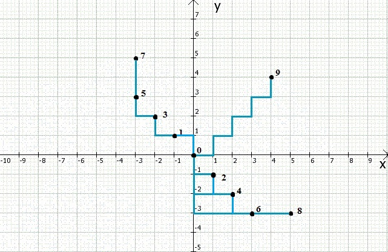

algorithm_with_dots-matrices
============================

Algorithm solves the problem of the points placement according to the length which is specified in the matrix.

__Example__:
The following matrix has been specified:
  
<table layout="fixed">
<tr align="center">
    <td width="20"> 0 </td><td width="20"> 2 </td><td width="20"> 2 </td><td width="20"> 4 </td><td width="20"> 4 </td><td width="20"> 6 </td><td width="20"> 6 </td><td width="20"> 8 </td><td width="20"> 8 </td><td width="20"> 8 </td>
</tr>
<tr align="center">
    <td> 2 </td><td> 0 </td><td> 4 </td><td> 2 </td><td> 6 </td><td> 4 </td><td> 8 </td><td> 6 </td><td> 10 </td><td> 8 </td>
</tr>
<tr align="center">
    <td> 2 </td><td> 4 </td><td> 0 </td><td> 6 </td><td> 2 </td><td> 8 </td><td> 4 </td><td> 10 </td><td> 6 </td><td> 8 </td>
</tr>
<tr align="center">
    <td> 4 </td><td> 2 </td><td> 6 </td><td> 0 </td><td> 8 </td><td> 2 </td><td> 10 </td><td> 4 </td><td> 12 </td><td> 8 </td>
</tr>
<tr align="center">
    <td> 4 </td><td> 6 </td><td> 2 </td><td> 8 </td><td> 0 </td><td> 10 </td><td> 2 </td><td> 12 </td><td> 4 </td><td> 8 </td>
</tr>
<tr align="center">
    <td> 6 </td><td> 4 </td><td> 8 </td><td> 2 </td><td> 10 </td><td> 0 </td><td> 12 </td><td> 2 </td><td> 14 </td><td> 8 </td>
</tr>
<tr align="center">
    <td> 6 </td><td> 8 </td><td> 4 </td><td> 10 </td><td> 2 </td><td> 12 </td><td> 0 </td><td> 14 </td><td> 2 </td><td> 8 </td>
</tr>
<tr align="center">
    <td> 8 </td><td> 6 </td><td> 10 </td><td> 4 </td><td> 12 </td><td> 2 </td><td> 14 </td><td> 0 </td><td> 16 </td><td> 8 </td>
</tr>
<tr align="center">
    <td> 8 </td><td> 10 </td><td> 6 </td><td> 12 </td><td> 4 </td><td> 14 </td><td> 2 </td><td> 16 </td><td> 0 </td><td> 8 </td>
</tr>
<tr align="center">
    <td> 8 </td><td> 8 </td><td> 8 </td><td> 8 </td><td> 8 </td><td> 8 </td><td> 8 </td><td> 8 </td><td> 8 </td><td> 0 </td>
</tr>
</table>

_Note_: Matrix must be symmetric square matrix.
        We skip the first row and col which are always must be:
 [ 0, 1, 2 .. ( len(row {or col because matrix is square}) - 1 ) ]: 
According to the matrix we can say the distance between two dots.  Thus, the distances:  
<ul>
    <li> 0->0 = 0 (which is obvious)</li>
    <li> 0->1 = 2
    <li> 0->2 = 2 
    ...
    <li> 0->9 = 8 </li>
    ...
</ul>

The initial dot 0 always has coordinates (0, 0). 
After running the script the results are following:
 [(0, 0), (-1, 1), (1, -1), (-2, 2), (2, -2), (-3, 3), (3, -3), (-3, 5), (5, -3), (4, 4)] 
If we visualise the result using Cartesian coordinate system we will get the picture: 
    
  _Note_: Blue color was used to indicate rules of calculating the distance.
  __Pay attention__: The distance is not weight of the line which _directly_ connects two dots (lines may be angular).